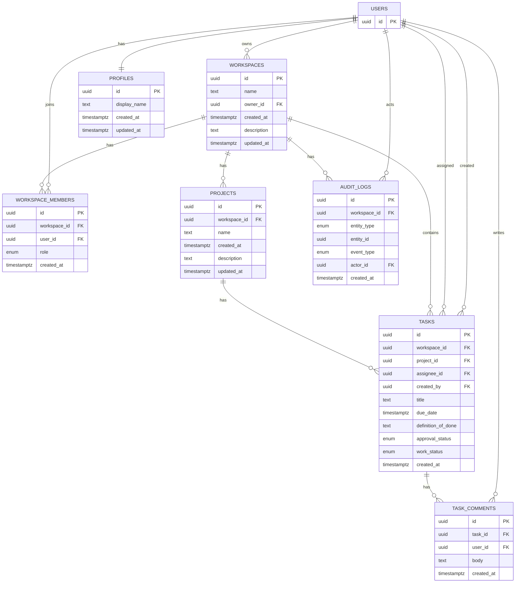

# プロダクト名：TeamFlow

「上長承認がないと着手できない」×「期限変更は履歴で残る」BtoBチームタスク管理SaaS MVP

https://teamflow-self-eight.vercel.app/

owner
email： user@example.com
password: hogehoge

member
email: member@example.com
password: hogehoge

# 1.プロジェクト概要・目的

## 1.1 背景

チームでプロジェクトを進行する際、以下の問題が頻繁に発生する

- タスクの責任者が曖昧になる
- 上長承認前に作業が進み手戻りが発生する
- 期限変更の経緯が管理されない
- 業務ルールが運用依存になり再現性がない

特にBtoB組織では「ルールは存在するが守られない」ことが生産性低下の原因となる

## 1.2 解決する課題

TeamFlowは以下を解決する。

- タスク責任者の明確化
- 承認前作業の禁止
- 期限変更履歴の完全追跡
- 業務ルールのシステム強制

## 1.3 対象ユーザー

- 5〜30人規模チーム
- 新規事業 / 開発 / 制作 / 営業PJ

### Role（RBAC）

- Owner
- Manager
- Member

# 2. 業務ルール（ドメインルール）

## 2.1 担当者

- タスク担当者は **必ず1名**
- 複数担当は禁止

---

## 2.2 タスク作成ルール

必須項目：

- 担当者
- 完了期限
- Definition of Done

未入力の場合作成不可。

---

## 2.3 承認ルール（最重要）

- 承認されるまで作業開始不可
- 承認権限：Manager以上
- **APIレベルで強制**

---

## 2.4 期限変更ルール

- Memberは直接変更不可
- コメントによる変更申請のみ可能
- Manager以上のみ変更可能
- **変更履歴を必ず保存**

---

## 2.5 状態変更ルール

approval_status ≠ Approved の場合：

- InProgress ❌
- Done ❌

# 3.実装機能一覧

## 3.1 認証・ユーザー

### 機能


- Supabase Authによるログイン/ログアウト/新規登録
- プロフィール(最低限：表示名)

### 管理項目


- display_name

## 3.2 Workspace(組織)


- Workspace作成
- Workspace管理者設定
- ユーザーRole管理

## 3.3 権限管理(RBAC)


### Role設定

- Owner
- Manager
- Member

### 権限制御

| 操作 | **Owner** | **Manager** | **Member** |
| --- | --- | --- | --- |
| **Task作成** | ✅️ | ✅️ | ✅️ |
| **承認** | ✅️ | ✅️ | ❌️ |
| **期限変更** | ✅️ | ✅️ | ❌️ |

## 3.3 Project管理


- Project作成
- Project一覧表示
- Project編集
- Project削除

## 3.4 Task管理


- タイトル(title)
- 担当者(assignee)
- 期日(due_date)
- 完了定義(definition_of_done)
- 承認ステータス(approval_status)
- 進捗ステータス(work_status)

### 進捗ステータス

- NotStarted
- InProgress
- Done

### 承認ステータス

- Draft
- PendingApproval
- Approved
- Rejected

承認済みのみ進捗更新可

## 3.5 承認フロー


### フロー

Task作成→承認申請→Manager承認→作業開始可能

### 機能

- 承認申請
- 承認
- 差し戻し(理由必須)

## 3.6 コメント機能


### 機能

- コメント投稿
- コメント閲覧

### 期限変更テンプレート

【期限変更申請】

旧期限：

新期限：

理由：

## 3.7 監査ログ


- 主要イベントを記録し、追跡可能にする
    - TASK_CREATED
    - APPROVED
    - REJECTED
    - STATUS_CHANGED
    - DUE_DATE_CHANGED

# 4.データベース設計

## 4.1 テーブル構成

- DB： Supabase(PostgreSQL)
- Workspace単位でデータ分離
- Supabase RLSによる認可制御

## 4.2テーブル構成(MVP)

## 4.2 テーブル構成 (MVP)

### workspaces

- id (uuid, PK)
- name (text, not null)
- owner_id (uuid, not null, FK → auth.users(id))
- created_at (timestamptz)
- description (text)
- updated_at (timestamptz)

---

### profiles

- id (uuid, PK, FK → auth.users(id))
- display_name (text)
- created_at (timestamptz)
- updated_at (timestamptz)

---

### workspace_members

- id (uuid, PK)
- workspace_id (uuid, FK → [workspaces.id](http://workspaces.id/))
- user_id (uuid, FK → auth.users(id))
- role (enum, not null)
    - OWNER
    - MANAGER
    - MEMBER
- created_at (timestamptz)

---

### projects

- id (uuid, PK)
- workspace_id (uuid, FK → [workspaces.id](http://workspaces.id/))
- name (text)
- created_at (timestamptz)
- description (text)
- created_by (uuid, FK → auth.users(id))
- updated_at (timestamptz)

---

### tasks

- id (uuid, PK)
- workspace_id (uuid, FK → [workspaces.id](http://workspaces.id/))
- project_id (uuid, FK → [projects.id](http://projects.id/))
- assignee_id (uuid, FK → auth.users(id))
- created_by (uuid, FK → auth.users(id))
- title (text)
- due_date (timestamptz)
- definition_of_done (text)
- approval_status (enum)
    - DRAFT
    - PENDING
    - APPROVED
    - REJECTED
- work_status (enum)
    - NOT_STARTED
    - IN_PROGRESS
    - DONE
- created_at (timestamptz, not null, default now())

---

### task_comments

- id (uuid, PK)
- task_id (uuid, FK → [tasks.id](http://tasks.id/))
- user_id (uuid, FK → auth.users(id))
- body (text)
- created_at (timestamptz)

---

### audit_logs

- id (uuid, PK)
- workspace_id (uuid, FK → [workspaces.id](http://workspaces.id/))
- entity_type (enum)
    - task
    - project
    - workspace
    - comment
- entity_id (uuid)
- event_type (enum)
    - CREATED
    - UPDATED
    - APPROVED
    - REJECTED
    - DELETED
    - DUE_DATE_CHANGED
- actor_id (uuid, FK → auth.users(id))
- created_at (timestamptz)

## 4.2 ER図



# 5. 状態遷移設計

## 5.1 ApprovalStatus

Draft

→ PendingApproval

→ Approved / Rejected

### 制約

Approved以外は作業開始不可。

---

## 5.2 WorkStatus

NotStarted

→ InProgress

→ Done

---

## ✅ 5.3 状態整合マトリクス

| Approval | NotStarted | InProgress | Done |
| --- | --- | --- | --- |
| Draft | ✅ | ❌ | ❌ |
| PendingApproval | ✅ | ❌ | ❌ |
| Rejected | ✅ | ❌ | ❌ |
| Approved | ✅ | ✅ | ✅ |

# 6. API設計

## 6.1 設計方針

- Supabase Auth
- Workspace所属チェック
- RBACチェック
- 状態遷移制約
- APIレベル強制
- audit_logs記録

---

## 6.2 共通レスポンス

| Code | Meaning |
| --- | --- |
| 400 | 入力不正 |
| 401 | 未認証 |
| 403 | 権限/状態違反 |
| 404 | 存在しない |
| 409 | 整合性違反 |

---

## 6.3 APIエンドポイント構成

## APIエンドポイント一覧（何をするか込み）

## API 設計

すべてのエンドポイントは認証必須です。認証には Supabase Auth を使用します。

### ロール定義

| ロール | 説明 |
| --- | --- |
| `owner` | ワークスペース所有者。全操作が可能 |
| `manager` | ワークスペース管理者。タスク承認・メンバー管理が可能 |
| `member` | 一般メンバー。タスクの作成・進捗更新が可能 |

---

### プロフィール

| メソッド | エンドポイント | 説明 | 権限 | リクエストボディ |
| --- | --- | --- | --- | --- |
| `GET` | `/api/me` | 自分のプロフィール取得 | ログインユーザー | - |
| `PATCH` | `/api/me` | 自分のプロフィール更新 | ログインユーザー | `display_name` (1〜50文字) |

---

### ワークスペース

| メソッド | エンドポイント | 説明 | 権限 | リクエストボディ |
| --- | --- | --- | --- | --- |
| `GET` | `/api/workspaces` | 所属ワークスペース一覧取得 | ログインユーザー | - |
| `POST` | `/api/workspaces` | ワークスペース作成 | ログインユーザー | `name` (必須, 1〜50文字), `description` (任意) |
| `GET` | `/api/workspaces/[id]` | ワークスペース詳細取得 | メンバー以上 | - |
| `PATCH` | `/api/workspaces/[id]` | ワークスペース情報更新 | owner のみ | `name` (任意, 1〜50文字), `description` (任意) |
| `DELETE` | `/api/workspaces/[id]` | ワークスペース削除 | owner のみ | - |

---

### ワークスペースメンバー

| メソッド | エンドポイント | 説明 | 権限 | リクエストボディ |
| --- | --- | --- | --- | --- |
| `GET` | `/api/workspaces/[id]/members` | メンバー一覧取得 | メンバー以上 | - |
| `PATCH` | `/api/workspaces/[id]/members/[userId]/role` | メンバーのロール変更 | owner / manager | `role` (`owner` | `manager` | `member`) |

---

### プロジェクト

| メソッド | エンドポイント | 説明 | 権限 | リクエストボディ |
| --- | --- | --- | --- | --- |
| `GET` | `/api/workspaces/[id]/projects` | プロジェクト一覧取得 | メンバー以上 | - |
| `POST` | `/api/workspaces/[id]/projects` | プロジェクト作成 | メンバー以上 | `name` (必須, 1〜100文字), `description` (任意) |
| `GET` | `/api/projects/[id]` | プロジェクト詳細取得 | メンバー以上 | - |
| `PATCH` | `/api/projects/[id]` | プロジェクト情報更新 | manager 以上 | `name` (任意, 1〜100文字), `description` (任意) |
| `DELETE` | `/api/projects/[id]` | プロジェクト削除 | manager 以上 | - |

---

### タスク

| メソッド | エンドポイント | 説明 | 権限 | リクエストボディ |
| --- | --- | --- | --- | --- |
| `GET` | `/api/projects/[id]/tasks` | タスク一覧取得 | メンバー以上 | - |
| `POST` | `/api/projects/[id]/tasks` | タスク作成 | メンバー以上 | `title` (必須, 1〜200文字), `assignee_id` (任意), `due_date` (任意, ISO 8601), `definition_of_done` (任意) |
| `GET` | `/api/tasks/[id]` | タスク詳細取得 | メンバー以上 | - |
| `PATCH` | `/api/tasks/[id]` | タスク情報更新 | 作成者 / manager 以上 | `title`, `assignee_id`, `due_date`, `definition_of_done`, `approval_status`, `work_status` (すべて任意) |
| `DELETE` | `/api/tasks/[id]` | タスク削除 | メンバー以上 | - |
| `PATCH` | `/api/tasks/[id]/status` | タスク進捗ステータス更新 | 担当者 / 作成者 / manager 以上 | `work_status` (`NOT_STARTED` | `IN_PROGRESS` | `DONE`) |
| `PATCH` | `/api/tasks/[id]/due-date` | タスク期限変更（履歴記録あり） | owner / manager | `new_due_date` (ISO 8601 | null), `reason` (任意) |

---

### タスク承認フロー

| メソッド | エンドポイント | 説明 | 権限 | 遷移 |
| --- | --- | --- | --- | --- |
| `POST` | `/api/tasks/[id]/submit-approval` | 承認申請 | 作成者 / 担当者 / manager 以上 | `DRAFT` → `PENDING` |
| `POST` | `/api/tasks/[id]/approve` | タスク承認 | owner / manager | `PENDING` → `APPROVED` |
| `POST` | `/api/tasks/[id]/reject` | タスク差し戻し | owner / manager | `PENDING` → `REJECTED` |

### 承認ステータス遷移

```
DRAFT ──submit-approval──▶ PENDING ──approve──▶ APPROVED
                                    └──reject──▶ REJECTED
```

> `work_status` を `IN_PROGRESS` または `DONE` に変更するには `approval_status` が `APPROVED` である必要があります。
> 

---

### タスクコメント

| メソッド | エンドポイント | 説明 | 権限 | リクエストボディ |
| --- | --- | --- | --- | --- |
| `GET` | `/api/tasks/[id]/comments` | コメント一覧取得 | メンバー以上 | - |
| `POST` | `/api/tasks/[id]/comments` | コメント投稿 | メンバー以上 | `body` (必須, 1〜2000文字) |
| `PATCH` | `/api/tasks/[id]/comments/[commentId]` | コメント編集 | 投稿者本人のみ | `body` (必須, 1〜2000文字) |
| `DELETE` | `/api/tasks/[id]/comments/[commentId]` | コメント削除 | 投稿者本人のみ | - |

---

### 監査ログ

| メソッド | エンドポイント | 説明 | 権限 | クエリパラメータ |
| --- | --- | --- | --- | --- |
| `GET` | `/api/workspaces/[id]/audit-logs` | 監査ログ一覧取得 | メンバー以上 | `limit` (任意, 1〜500, デフォルト: 100) |

---

### 共通エラーレスポンス

| ステータス | 説明 |
| --- | --- |
| `400 Bad Request` | バリデーションエラー / 不正な状態遷移 |
| `401 Unauthorized` | 未認証 |
| `403 Forbidden` | 権限不足 |
| `404 Not Found` | リソースが存在しない |
| `500 Internal Server Error` | サーバーエラー |

# 7. ディレクトリ構成（3層アーキテクチャ）

## Layer構成

```
Presentation
↓
Application
↓
Infrastructure
```

---

## 完成構成

```
src/
 ├── app/                  # Presentation
 ├── components/
 ├── application/          # Usecases
 │    ├── usecases/
 │    ├── policies/
 │    ├── ports/
 │    └── errors/
 ├── infrastructure/       # DB実装
 │    ├── repositories/
 │    └── supabase/
 ├── lib/
 └── types/
```

---

### 依存ルール

✅ app → application

✅ application → ports

✅ infrastructure → ports実装

❌ infrastructure → application

---

# 8. 制約事項

- 承認前進捗変更禁止
- Workspace外アクセス禁止
- 担当者1名固定
- Member期限変更禁止

---

# 9. 将来的拡張性

- 招待機能
- サブタスク
- 通知
- ダッシュボード
- ガントチャート

---

# 10. 技術スタック

### Frontend

- TypeScript
- Next.js 14
- React 18
- shadcn/ui
- Tailwind

### Backend

- Next.js Route Handlers
- RBAC + RLS

### DB

- Supabase PostgreSQL
- Migration管理

### Auth

- Supabase Auth

### Deploy

- Vercel
